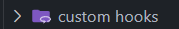
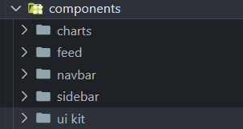

# Documentación del frontend

## Conocimientos requeridos

- React (recomendado estudiar secciones 1-9 del curso de LearnThisAcademy)
- HTML
- CSS
- JavaScript

**Dependencias**

- TailwindCSS
- Heroicons
- React Router

## Índice

- [Anatomía de la aplicación](#anatomía-de-la-aplicación)

  - [Glosario de elementos](#glosario-de-elementos)
  - [Directorios notables](#directorios-notables)

- [Componentes de UI](#componentes-de-ui)
- [Custom hooks](#custom-hooks)
- [Componentes de UI](#componentes-de-ui)

## Anatomía de la aplicación


### Glosario de elementos

**Componentes**

<table>
  <tr>
    <th>Elemento</th>
    <th>Descripción</th>
    <th>Imágen</th>
  </tr>
  <tr>
    <td><b>Un componente</b></td>
    <td>Un componente individual.</td>
    <td></td>
  </tr>
  <tr>
    <td><b>Varios componentes</b></td>
    <td>Indica que existe más de una instancia de este componente en el nivel en el que se encuentre.</td>
    <td></td>
  </tr>
  <tr>
    <td><b>Generador de lista de componentes</b></td>
    <td>
      Un componente que genera un conjunto de componentes independientes en columna dentro de un div. En este ejemplo, List genera un conjunto de ProfileLinks.
    </td>
    <td></td>
  </tr>
  <tr>
    <td><b>Un componente que se heredó como prop</b></td>
    <td>Se indica su origen con una tuerca naranja.</td>
    <td></td>
  </tr>
  <tr>
    <td><b>Outlet para componentes ruteados</b></td>
    <td>Un outlet para componentes ruteados.</td>
    <td></td>
  </tr>
   <tr>
    <td><b>Componentes opcionales</b></td>
    <td>
      Están declarados dentro de otro, pero no se renderizan a menos que su padre reciba la indicación (aquí se hace a través de un prop con un string: 'message' o 'notifications').
    </td>
    <td></td>
  </tr>
</table>

**Estados y setters**

<table>
  <tr>
    <td>
      
    </td>
    <td>
      
    </td>
  </tr>
</table>

- Los de color gris no forman parte de ningún contexto.
- Los de color rosado forman parte del contexto de App.
- Los de color azul forman parte del contexto de la Sidebar.
- Si un estado está subrayado, significa que ahí fue donde se declaró originalmente, y por ende, ahí mismo origina también su método set.

**Esqueleto**

<table>
  <tr>
    <td>
      
    </td>
    <td>
      Indica que el componente tiene un componente esqueleto como fallback para lazy.
    </td>
  </tr>
</table>

**Props**

En el diagrama no se detallan las props específicas de cada componente, pues sus usos en la aplicación (en la mayoría de los casos) son muy sencillos. En los casos donde no es tan fácil discernir con el árbol de nodos, se utilizan estos íconos como apoyo:

<table>
  <tr>
    <td>
      
    </td>
    <td>
      Indica que una prop del componente está configurando algo.
    </td>
  </tr>
  <tr>
    <td>
      
    </td>
    <td>
      Indica que una prop del componente contiene un componente.
    </td>
  </tr>
</table>

Estos íconos están para ayudar a dar contexto en los casos especiales dentro de la estructura de la aplicación, por ejemplo:

<table>
  <tr>
    <td>
      <b>Caso 1</b>
    </td>
    <td>
      <b>Caso 2</b>
    </td>
  </tr>
  <tr>
    <td>
      
    </td>
    <td>
      
    </td>
  </tr>
  <tr>
    <td>
      Cada instancia del ActionButton tiene un prop que indica a su List, cuál de los componentes que soporta tiene que generar.<br>
    </td>
    <td>
      El componente DropdownLink se está pasando como prop desde cada SidebarDropdown a su respectiva List.
    </td>
  </tr>
</table>

_NOTA: En el **caso 1** los componentes se declaran en List para permitir el lazy loading de los mismos (usualmente se heredan como props, como en el **caso 2**)._

## Directorios notables

<table>
  <tr>
    <th><b>Directorio</b></th>
    <th><b>Descripción</b></th>
  </tr>
  <tr>
    <td>
      
    </td>
    <td>
      Contiene todos los componentes ruteados (App, Ecommerce, Profile, etc).
    </td>
  </tr>
  <tr>
    <td>
      
    </td>
    <td>
      Contiene los componentes no ruteados (Navbar, Sidebar, todos los que se ven en el diagrama).
    </td>
  </tr>
  <tr>
    <td>
      
    </td>
    <td>
      Contiene el loader principal de la aplicación, así como la configuración y datos de la mayoría de componentes, siempre y cuando los datos no contengan otros componentes, pues hay detalles en la importación y fue mejor declararlos en el componente directamente. Por el momento, contiene: <br>
      <ul>
        <li>
          Datos de mensajes
        </li>
        <li>
          Datos de notificaciones
        </li>
        <li>
          Links de perfil
        </li>
        <li>
          Links de los dropdowns
        </li>
        <li>
          Límite para pantalla ancha
        </li>
      </ul>
    </td>
  </tr>
</table>

## Custom hooks



### useClickOutside

- **Archivo:** `useClickOutside.js`

Se encarga de generar una referencia, observar el componente que la contenga con `useEffect` y **ejecuta una función cuando se haga click fuera del componente**.

**Uso:**

```jsx
const Component = () {
    let domNode = useClickOutside(() => console.log('Click afuera'))

    return(
        <div ref={domNode}>Si clickeas fuera de mí algo sucede<div>
    )
}
```

### useScreenWidth

- **Archivo:** `useScreenWidth.js`

Se encarga de monitorear el ancho de la pantalla. Recibe un límite de pixelaje, si el pixelaje de la pantalla excede el límite, entonces devuelve verdadero, de lo contrario devuelve falso.

**Uso:**

```jsx
const screenIsWide = useScreenWidth(500) // Valores mayor a 500 devuelven verdadero; menores, falso
```

## Componentes de UI



<table>
  <tr>
    <th>Elemento</th>
    <th>Archivo</th>
    <th>Descripción</th>
  </tr>
  <tr>
    <td><b>Ávatar</b></td>
    <td><code>Avatar.jsx</code></td>
    <td>Avatar animado. Recibe una ruta de imagen.</td>
  </tr>
  <tr>
    <td><b>Botón</b></td>
    <td><code>Button.jsx</code></td>
    <td>Botón animado. Recibe un ícono, un estado, un setter. Cuando se hace click, invierte el valor del estado.</td>
  </tr>
  <tr>
    <td><b>Lista</b></td>
    <td><code>List.jsx</code></td>
    <td>Generador de lista de componentes en columna. Recibe un componente de formato, un arreglo de objetos (o un objeto individual), un nombre, estilo y props extra. La lista genera una columna de componentes a partir de los objetos y les pasa los props contenidos en cada uno. En caso de no recibir datos, la lista solo notifica que no hay elementos.</td>
  </tr>
  <tr>
    <td><b>Botón candado</b></td>
    <td><code>LockToggle.jsx</code></td>
    <td>Botón de candado animado, recibe un setter y un estado. Bajo click invierte el estado.</td>
  </tr>
  <tr>
    <td><b>Link de perfil, link de dropdown</b></td>
    <td><code>ProfileLink.jsx</code>, <code>DropdownLink.jsx</code></td>
    <td>Formato de NavLink con estilos hover y active para sus contenedores respectivos (dropdown y perfil).</td>
  </tr>
  <tr>
    <td><b>Mensaje, notificación</b></td>
    <td><code>Message.jsx</code>, <code>Notification.jsx</code></td>
    <td>Formatos para mensajes y notificaciones. Notificación solo recibe título y texto. Mensaje recibe ávatar, título y texto.</td>
  </tr>
  <tr>
    <td><b>Ícono de búsqueda</b></td>
    <td><code>SearchIcon.jsx</code></td>
    <td>Formato para ícono de búsqueda con estilo de hover.</td>
  </tr>
  <tr>
    <td><b>Etiqueta de sección pegajosa</b></td>
    <td><code>StickySectionTag.jsx</code></td>
    <td>Etiqueta de sección pegajosa, se adhiere al tope del contenedor cuando lo alcanza por desplazo de scroll. Si se declaran múltiples etiquetas, se van encimando una sobre otra cuando llegan al tope, la última en llegar es la que queda hasta arriba. Se pueden devolver a su lugar haciendo scroll de vuelta.</td>
  </tr>
  <tr>
    <td><b>Link al home</b></td>
    <td><code>LogoLink.jsx</code></td>
    <td>Navlink que bajo click manda al home, consiste de una imagen y un h1. Recibe path de la imagen y ruta.</td>
  </tr>
</table>
